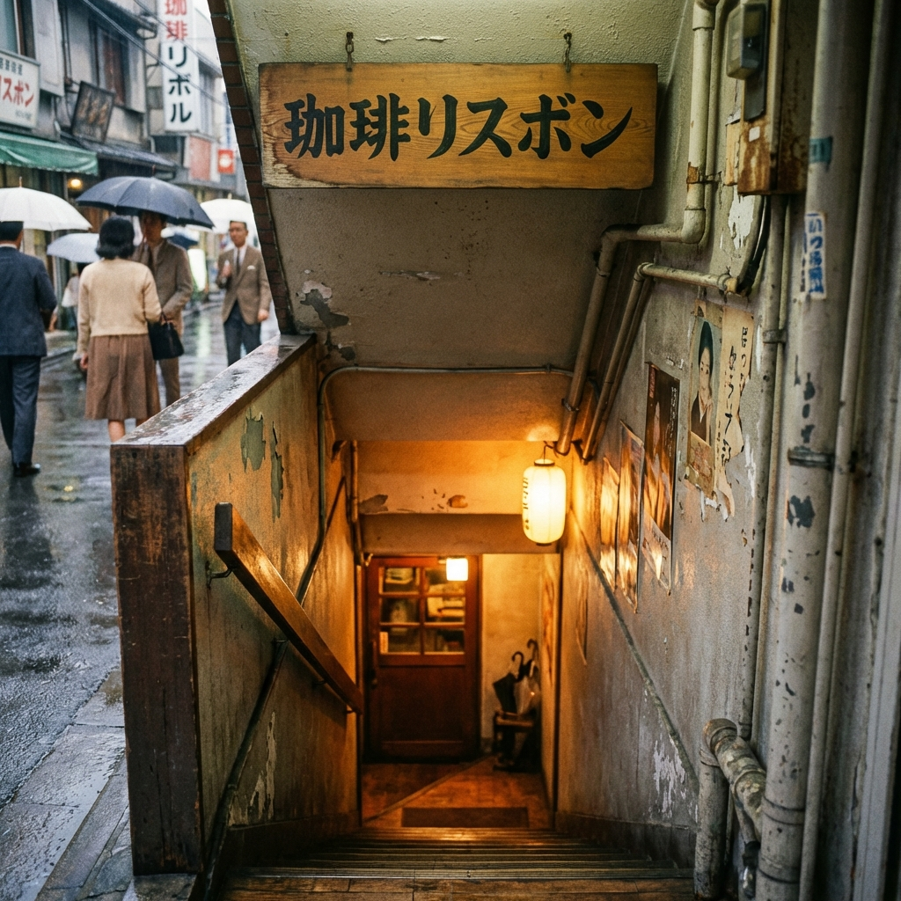

# 珈琲リスボン 公式Webサイト



## 概要

東京・三鷹の老舗純喫茶「珈琲リスボン」の公式Webサイトです。
創業1961年、60年以上の歴史を持つ真正の純喫茶の魅力を、昭和モダンの美学とともにデジタル空間に再現しています。

## サイトコンセプト

**「三鷹の地下に流れる、60年の静寂」**

## 主な機能

- 📱 完全レスポンシブ対応
- 🎨 昭和レトロな琥珀色・木目調デザイン
- 🖼️ 高品質なビジュアル表現
- 🔍 SEO最適化
- ⚡ スムーズなアニメーション

## サイト構成

1. **ヒーロー** - 地下への階段と創業年
2. **重要なお知らせ** - 禁煙・現金のみ・ベビーカー不可
3. **リスボンの歴史** - 三鷹と共に歩んだ60年
4. **お品書き** - モーニング、ランチ、ドリンク
5. **店舗情報** - 営業時間、アクセス、地図

## 技術スタック

- HTML5
- CSS3（カスタムプロパティ、Grid、Flexbox）
- Vanilla JavaScript
- Google Fonts（Noto Serif JP、Noto Sans JP）

## ローカル開発

```bash
# HTTPサーバーを起動
npx http-server -p 8000

# ブラウザで開く
http://localhost:8000
```

## 店舗情報

- **営業時間**: 平日・土曜 7:30-20:00 / 祝日 7:30-19:00
- **定休日**: 日曜日
- **住所**: 東京都三鷹市下連雀3-27-9 ニューエミネンス B1
- **アクセス**: JR三鷹駅南口より徒歩1分

---

© 2026 珈琲リスボン All Rights Reserved.
